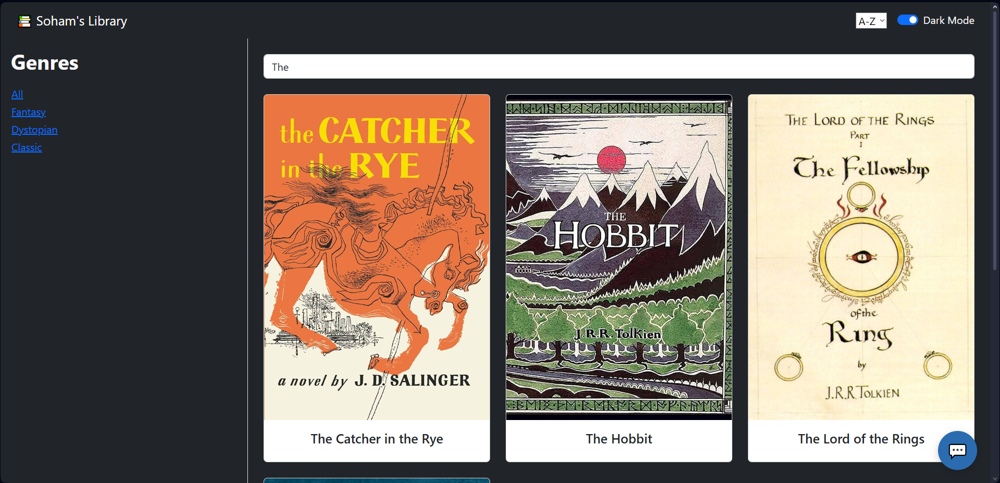
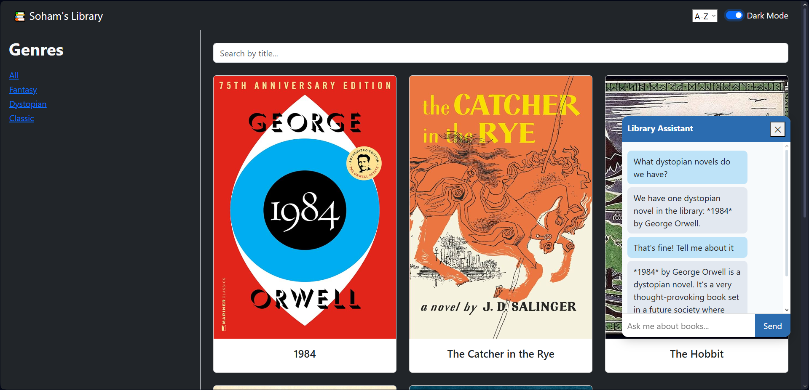

# **📚 Soham’s Library — MERN + AI Chatbot**

A full-stack project built to practice real-world engineering: scalable architecture, React state design, database integration, and LLM-based features.

Originally a static JSON frontend, it has evolved into a **complete MERN application** with:

✔️ A backend powered by Express + MongoDB
✔️ A clean React + TypeScript frontend
✔️ A fully integrated **chat popup using LangChain**
✔️ Real database queries instead of hardcoded data

This project is actively maintained and expanded as part of my 2025 AI studies.

---

## **🔥 What This Project Demonstrates**

* Clean, modular React components
* Migration from a static JSON setup to a full backend
* REST API design and state synchronization
* MongoDB + Mongoose models for persistent storage
* Real-world MERN app structure
* Debugging + solving local environment issues
* LLM integration using **LangChain**
* Local inference pipelines with a small LLM model

---

## **📷 Demo**

### App View



### Chat Popup



The chat window can answer basic questions about the library and interact with the user's book collection.

---

## **🚀 Current Features**

### **Frontend**

* View all books stored in the MongoDB database
* Search by title
* Sort A–Z / Z–A
* Filter by genre
* Collapsible sidebar
* Fully responsive layout
* Built with React + Vite + TypeScript
* **Interactive chat popup (LangChain-powered)**

### **Backend**

* Express server on `localhost:5000`
* MongoDB database with a Book schema
* `/books` API with GET and POST
* `/book/:id` API route (title, author, synopsis)
* TypeScript backend with ts-node-dev
* Clean controller/model structure

---

## **🤖 AI Integration (New)**

A built-in chat popup connects to a local LLM via **LangChain**, enabling:

* Book Q&A
* Summaries
* Genre explanations
* Conversational queries
* Simple recommendations

The system is designed for full tool integration, although current limitations of the locally running model prevent direct API calls from the LLM.
The architecture remains **future-ready**.

---

## **🛠 Architecture Overview**

```
sohams-library/
  frontend/   → React + Vite + TypeScript
  backend/    → Node + Express + Mongoose
```

The frontend fetches all data dynamically from MongoDB.
The backend handles routing, data validation, and AI-related endpoints.

---

## **📈 Roadmap**

### **Frontend**

* Add-book modal
* Image upload
* Purchased view
* Multi-page routing
* Better chat styling + typing indicators

### **Backend**

* Full CRUD (edit + delete)
* File upload support
* User accounts (optional)

### **AI**

* Fully connected retrieval system
* Proper API-augmented LLM (once model support is available)
* Richer book recommendations

---

## **💻 Tech Stack**

### Frontend

* React
* TypeScript
* Vite
* Bootstrap

### Backend

* Node.js
* Express
* MongoDB
* Mongoose
* TypeScript
* ts-node-dev

### AI

* LangChain
* Local inference pipeline

---

## **📁 Getting Started**

### 1. Clone the repo

```bash
git clone https://github.com/SohamtheCodesmith/sohams-library.git
```

---

## **🚀 Running the Project**

### **Backend**

```bash
cd backend
npm install
npm run dev
```

Backend runs on `http://localhost:5000`.

Ensure MongoDB is running locally or update the connection URI for Atlas.

---

### **Frontend**

```bash
cd frontend
npm install
npm run dev
```

Frontend runs on `http://localhost:5173`.

---

## **📌 Notes**

This project evolves continuously, especially the chatbot system.
New features, improvements, and architectural upgrades are added periodically.