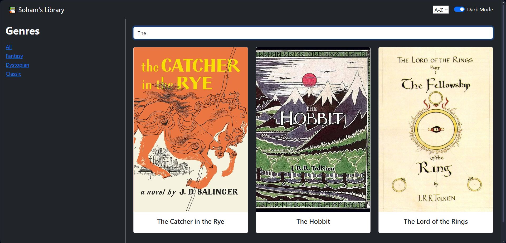

# **📚 Soham's Library**

A full-stack personal project built to sharpen my React skills and demonstrate my ability to design, refactor, and scale real-world applications.

Originally a simple frontend powered by a static JSON file, **the project has now been upgraded into a complete MERN-style system** with a dedicated backend, live MongoDB database, API routing, and component-driven UI.

This is an ongoing project, actively improved every week.

---

## **🔥 What This Project Demonstrates**

* Building clean, reusable, modular React components
* Migrating from static assets to a proper backend
* Designing REST APIs and integrating them with frontend state
* Using Mongoose + MongoDB for real persistent storage
* Real-world application structure (frontend + backend separation)
* Debugging, environment setup, and solving cross-platform issues
* Incremental development, clean commits, and maintainable architecture

### **📷 Demo**


---

## **🚀 Current Features**

### **Frontend**

* Browse a real database-backed collection of books
* Filter by genre
* Search books by title
* Sort A–Z / Z–A
* Collapsible sidebar
* Dark mode toggle
* Fully responsive layout (Bootstrap)

### **Backend**

* Express server running on `localhost:5000`
* MongoDB database storing all books
* Mongoose schema + model
* `/books` API route with `GET` and `POST` support
* Real-time sync between frontend and backend (no static JSON anymore)

---

## **🛠 Architecture Overview**

```
sohams-library/
  frontend/   → React + Vite + TS
  backend/    → Node + Express + Mongoose
```

The frontend now fetches all book data **from MongoDB**, not from local JSON.

The backend is fully functional, with:

* API routes
* Controllers
* Mongoose models
* TypeScript runtime via ts-node-dev

---

## **📈 Roadmap (Next 1–2 Weeks)**

These milestones are already planned and in progress:

### **Frontend**

* Modal to add new books
* Image upload support
* A “cart” feature
* A “purchased” view
* Multi-page support with React Router

### **Backend**

* Full CRUD (add/edit/delete)
* API route for book uploads
* User accounts and sessions (optional)

### **AI Integration**

* **LangChain chatbot** integrated directly into the app

  * Can answer book queries
  * Summarise entries
  * Search the database
  * Possibly generate recommendations

A lot more updates will be shipped rapidly — this is an actively evolving project.

---

## **💻 Tech Stack**

### **Frontend**

* React + TypeScript
* Vite
* Bootstrap 5

### **Backend**

* Node.js
* Express
* MongoDB
* Mongoose
* TypeScript (via ts-node-dev)

### **Tools**

* VSCode
* MongoDB Compass
* Git & GitHub
* LangChain (upcoming)

---

## **📁 Getting Started**

### **1. Clone the repository**

```bash
git clone https://github.com/SohamtheCodesmith/sohams-library.git
```

---

## **🚀 Running the Project**

### **Backend Setup (Required)**

#### Install backend dependencies:

```bash
cd backend
npm install
```

#### Start MongoDB:

* **If local:** ensure MongoDB service is running
* **If using Compass:** open Compass
* **If using Atlas:** update `mongoose.connect()` URI in `server.ts`

#### Run backend server:

```bash
npm run dev
```

Backend will start on:
`http://localhost:5000`

---

### **Frontend Setup**

#### Install frontend dependencies:

```bash
cd ../frontend
npm install
```

#### Run Vite:

```bash
npm run dev
```

Frontend will start on:
`http://localhost:5173`

---

## **📌 Notes**

This project is under **active development**, and major new features (including a backend chatbot) are being added over the next few days.

If you're reviewing this project:
➡️ You’re seeing it mid-evolution — and the pace of development is very rapid.